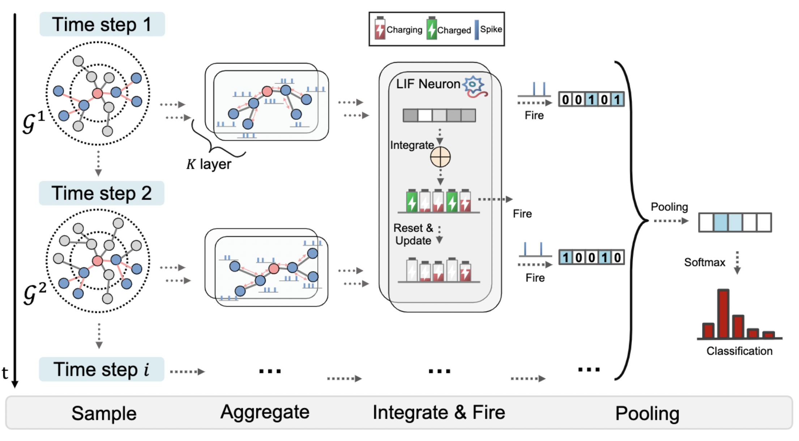

# SpikeNet
> [**Scaling Up Dynamic Graph Representation Learning via Spiking Neural Networks**](https://arxiv.org/abs/2208.10364) (AAAI 2023)
>
> Jintang Li, Zhouxin Yu, Zulun Zhu, Liang Chen, Qi Yu, Zibin Zheng, Sheng Tian, Ruofan Wu, Changhua Meng    

**This repository is an official PyTorch implementation of SpikeNet.**
<div align="center">
  
</div><br/>


# Abstract
Recent years have seen a surge in research on dynamic graph representation learning, which aims to model temporal graphs that are dynamic and evolving constantly over time. However, current work typically models graph dynamics with recurrent neural networks (RNNs), making them suffer seriously from computation and memory overheads on large temporal graphs. So far, scalability of dynamic graph representation learning on large temporal graphs remains one of the major challenges. In this paper, we present a scalable framework, namely SpikeNet, to efficiently capture the temporal and structural patterns of temporal graphs. We explore a new direction in that we can capture the evolving dynamics of temporal graphs with spiking neural networks (SNNs) instead of RNNs. As a low-power alternative to RNNs, SNNs explicitly model graph dynamics as spike trains of neuron populations and enable spike-based propagation in an efficient way. Experiments on three large real-world temporal graph datasets demonstrate that SpikeNet outperforms strong baselines on the temporal node classification task with lower computational costs. Particularly, SpikeNet generalizes to a large temporal graph (2M nodes and 13M edges) with significantly fewer parameters and computation overheads.

# Dataset
## Overview
|             | DBLP    | Tmall     | Patent     |
| ----------- | ------- | --------- | ---------- |
| #nodes      | 28,085  | 577,314   | 2,738,012 |
| #edges      | 236,894 | 4,807,545 | 13,960,811 |
| #time steps | 27      | 186       | 25         |
| #classes    | 10      | 5         | 6          |

## Download datasets
+ DBLP
+ Tmall
+ Patent
  
All dataset can be found at [Dropbox](https://www.dropbox.com/sh/palzyh5box1uc1v/AACSLHB7PChT-ruN-rksZTCYa?dl=0). 
You can download the datasets and put them in the folder `data/`, e.g., `data/dblp`.

## (Optional) Re-generate node features via DeepWalk
Since these datasets have no associated node features, we have generated node features via unsupervised DeepWalk method (saved as `.npy` format). 
You can find them at [Dropbox](https://www.dropbox.com/sh/palzyh5box1uc1v/AACSLHB7PChT-ruN-rksZTCYa?dl=0) as well. 
Only `dblp.npy` is uploaded due to size limit of Dropbox. 

(Update) The generated node features for Tmall and Patent datasets have been shared through Aliyun Drive, and the link is as follows: https://www.aliyundrive.com/s/LH9qa9XZmXa. 

Note: Since Aliyun Drive does not support direct sharing of npy files, you will need to manually change the file extension `.txt` to `.npy` after downloading. 


We also provide the script to generate the node features. Alternatively, you can generate them on your end (this will take about minutes to hours):

```bash
python generate_feature.py --dataset dblp
python generate_feature.py --dataset tmall --normalize
python generate_feature.py --dataset patent --normalize
```

## Overall file structure
```bash
SpikeNet
├── data
│   ├── dblp
│   │   ├── dblp.npy
│   │   ├── dblp.txt
│   │   └── node2label.txt
│   ├── tmall
│   │   ├── tmall.npy
│   │   └── tmall.txt
│   │   ├── node2label.txt
│   ├── patent
│   │   ├── patent_edges.json
│   │   ├── patent_nodes.json
│   │   └── patent.npy
├── figs
│   └── spikenet.png
├── spikenet
│   ├── dataset.py
│   ├── deepwalk.py
│   ├── layers.py
│   ├── neuron.py
│   ├── sample_neighber.cpp
│   └── utils.py
├── generate_feature.py
├── main.py
├── main_static.py
├── README.md
├── setup.py
```
# Requirements

```
tqdm==4.59.0
scipy==1.5.2
texttable==1.6.2
torch==1.9.0
numpy==1.22.4
numba==0.56.4
scikit_learn==1.0
torch_cluster (optional, only for random walk sampler)
```
In fact, the version of these packages does not have to be consistent to ours. For example, Pytorch 1.6~-1.12 should also work.


# Usage

## Build neighborhood sampler
```bash
python setup.py install
```

## Run SpikeNet

```bash
# DBLP
python main.py --dataset dblp --hids 128 10 --batch_size 1024 --p 0.5 --train_size 0.4
python main.py --dataset dblp --hids 128 10 --batch_size 1024 --p 0.5 --train_size 0.6
python main.py --dataset dblp --hids 128 10 --batch_size 1024 --p 0.5 --train_size 0.8

# Tmall
python main.py --dataset tmall --hids 512 10 --batch_size 1024 --p 1.0 --train_size 0.4
python main.py --dataset tmall --hids 512 10 --batch_size 1024 --p 1.0 --train_size 0.6
python main.py --dataset tmall --hids 512 10 --batch_size 1024 --p 1.0 --train_size 0.8

# Patent
python main.py --dataset patent --hids 512 10 --batch_size 2048 --p 1.0 --train_size 0.4
python main.py --dataset patent --hids 512 10 --batch_size 2048 --p 1.0 --train_size 0.6
python main.py --dataset patent --hids 512 10 --batch_size 2048 --p 0.5 --train_size 0.8
```


# On the extention to stastic graphs
Actually, SpikeNet is not only applicaple for temporal graphs, it is also straightforward to extend to stastic graphs by defining a time step hyperparameter $T$ manually.
In this way, the sampled subgraph at each time step naturally form graph snapshot. We can use SpikeNet to capture the *evolving* dynamics of sampled subgraphs.
Due to space limit, we did not discuss this part in our paper. However, we believe this is indeed necessary to show the effectiveness of our work.


We provide a simple example for the usage on stastic graphs datasets `Flickr` and `Reddit` (be sure you have PyTorch Geometric installed):

```bash
# Flickr
python main_static.py --dataset flickr --surrogate super

# Reddit
python main_static.py --dataset reddit --surrogate super
```

We report Micro-F1 score and the results are as follows:

| Method     | Flickr      | Reddit      |
| ---------- | ----------- | ----------- |
| GCN        | 0.492±0.003 | 0.933±0.000 |
| GraphSAGE  | 0.501±0.013 | 0.953±0.001 |
| FastGCN    | 0.504±0.001 | 0.924±0.001 |
| S-GCN      | 0.482±0.003 | 0.964±0.001 |
| AS-GCN     | 0.504±0.002 | 0.958±0.001 |
| ClusterGCN | 0.481±0.005 | 0.954±0.001 |
| GraphSAINT | 0.511±0.001 | 0.966±0.001 |
| SpikeNet   | 0.515±0.003 | 0.953±0.001 |

# Reference
```bibtex
@inproceedings{li2023scaling,
  author    = {Jintang Li and
               Zhouxin Yu and
               Zulun Zhu and
               Liang Chen and
               Qi Yu and
               Zibin Zheng and
               Sheng Tian and
               Ruofan Wu and
               Changhua Meng},
  title     = {Scaling Up Dynamic Graph Representation Learning via Spiking Neural
               Networks},
  booktitle = {{AAAI}},
  pages     = {8588--8596},
  publisher = {{AAAI} Press},
  year      = {2023}
}
```
